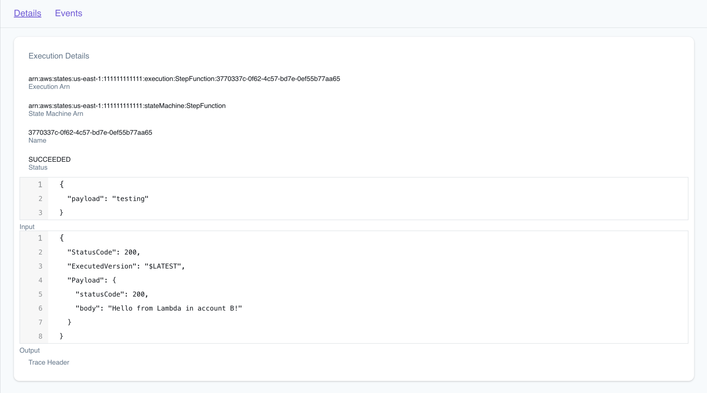

# Testing cross-account Step Functions to Lambda setup

This repository contains a simple example of how to set up a Step Functions state machine that invokes a Lambda function in a different account. The state machine is defined in a SAM template, and the Lambda function is defined in a separate SAM template in a different account.


LocalStack supports cross-account setup that allows you to namespace resources based on the AWS Account ID. In this example, you can use two local AWS accounts to simulate the cross-account setup. They are:

- **Account A** (`111111111111`): The account where the Step Functions state machine is defined.
- **Account B** (`222222222222`): The account where the Lambda function is defined.

## Prerequisites

- [Docker](https://docs.docker.com/get-docker/)
- [SAM CLI](https://docs.aws.amazon.com/serverless-application-model/latest/developerguide/serverless-sam-cli-install.html)
- [LocalStack](https://docs.localstack.cloud/getting-started/installation/)
- [`samlocal`](https://github.com/localstack/aws-sam-cli-local)

## Create the Step Functions state machine

Open a terminal and provide the following `AWS_ACCOUNT_ID` and `AWS_SECRET_ACCESS_KEY` environment variables:

```bash
export AWS_SECRET_ACCESS_KEY=test
export AWS_ACCESS_KEY_ID=111111111111
```

Run the following commands to create the Step Functions state machine:

```bash
samlocal build
samlocal  deploy --guided --capabilities CAPABILITY_NAMED_IAM
```

You'll be prompted to provide the following information:

- `StepFunctionName`: The name of the Step Functions state machine.
- `StepFunctionRoleName`: The name of the IAM role that grants permissions to the Step Functions state machine.
- `CrossAccountID`: The AWS Account ID of the account where the Lambda function is defined (`222222222222`).
- `LambdaFunctionName`: The name of the Lambda function in the other account.
- `Region`: The AWS region where the Step Functions state machine is deployed.

Choose `Y` for other prompts to confirm the deployment. After a successful deployment, you'll see the ARN of the Step Functions state machine.

```bash
Outputs                                                                                              
------------------------------------------------------------------------------------------------------
Key                 StateMachineArn                                                                  
Description         This is the ARN of the state machine                                             
Value               arn:aws:states:us-east-1:111111111111:stateMachine:StepFunction                  

Key                 AccountId                                                                        
Description         Account Id                                                                       
Value               111111111111                                                                     

Key                 StepFunctionRoleName                                                             
Description         Name of the step function's execution role                                       
Value               crossAccLambdaFunctionRole                                                       
------------------------------------------------------------------------------------------------------
```

## Create the Lambda function

Open another terminal and provide the following `AWS_ACCOUNT_ID` and `AWS_SECRET_ACCESS_KEY` environment variables:

```bash
export AWS_SECRET_ACCESS_KEY=test
export AWS_ACCESS_KEY_ID=222222222222
```

Run the following commands to create the Lambda function:

```bash
samlocal deploy -t lambda-function.yaml --guided --capabilities CAPABILITY_NAMED_IAM
```

You'll be prompted to provide the following information:

- `FunctionName`: The name of the Lambda function (defined in the other account).
- `FunctionRoleName`: The name of the IAM role that grants permissions to the Lambda function.
- `FirstAccountID`: The AWS Account ID of the account where the Step Functions state machine is defined (`111111111111`).
- `StepFunctionRoleName`: The name of the IAM role that grants permissions to the Step Functions state machine.

Choose `Y` for other prompts to confirm the deployment. After a successful deployment, you'll see the ARN of the Lambda function.

```bash
-----------------------------------------------------------------------------------------------------
ResourceStatus            ResourceType              LogicalResourceId         ResourceStatusReason    
-----------------------------------------------------------------------------------------------------
CREATE_COMPLETE           AWS::IAM::Role            LambdaRole                -                       
CREATE_COMPLETE           AWS::Lambda::Function     LambdaFunction            -                       
CREATE_COMPLETE           AWS::Lambda::Permission   LambdaResourcePolicy      -                       
CREATE_COMPLETE           AWS::CloudFormation::St   sam-app                   -                       
                          ack                                                                         
-----------------------------------------------------------------------------------------------------


Successfully created/updated stack - sam-app in us-east-1
```

## Test the Step Functions state machine

To test the Step Functions state machine, run the following command:

```bash
awslocal stepfunctions start-execution \
    --state-machine-arn arn:aws:states:us-east-1:111111111111:stateMachine:StepFunction \
    --input "{ \"payload\": \"testing\"}"
```

You can enter the State Machine ARN that you received after deploying the Step Functions state machine. The input payload is a JSON object that contains the key `payload` with the value `testing`.

You can check the LocalStack logs to verify that the Step Functions state machine successfully invokes the Lambda function in the other account. Navigate to the [Step Functions](https://app.localstack.cloud/inst/default/resources/stepfunctions) resource in the LocalStack Web Application and check the recent execution to verify the output.


